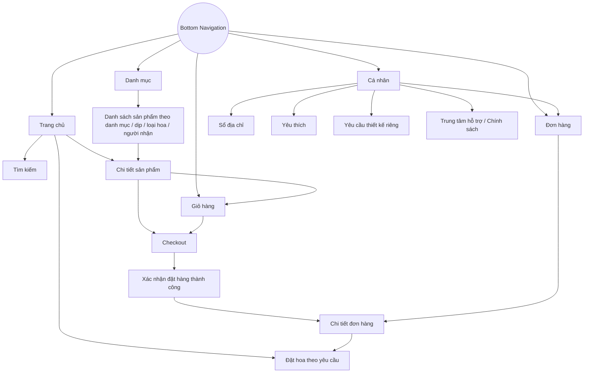
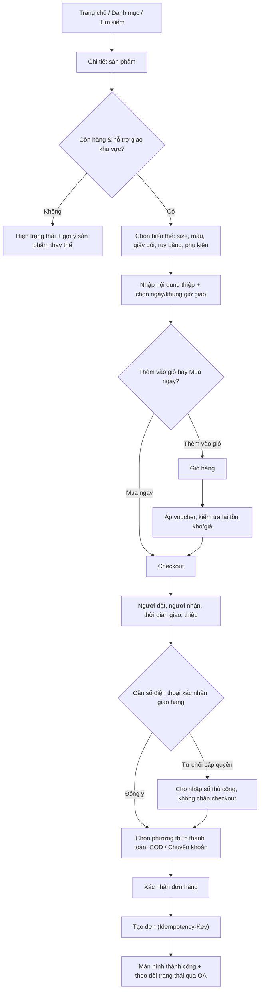

# 2. Sitemap & User flow

## 2.1 Sitemap

5 mục Bottom Navigation là gốc của toàn bộ cây điều hướng; các luồng phụ (checkout, đặt theo yêu cầu, chi tiết đơn) mở dạng full-screen từ những gốc này chứ không nằm trong bottom nav.

## 2.2 User flow — mua hoa

Luồng "mua ngay" và "thêm vào giỏ" hội tụ tại checkout; ba điểm rẽ vận hành thực tế (hết hàng, ngoài khu vực giao, từ chối cấp số điện thoại) được xử lý tại chỗ thay vì để rơi vào lỗi chung chung.

