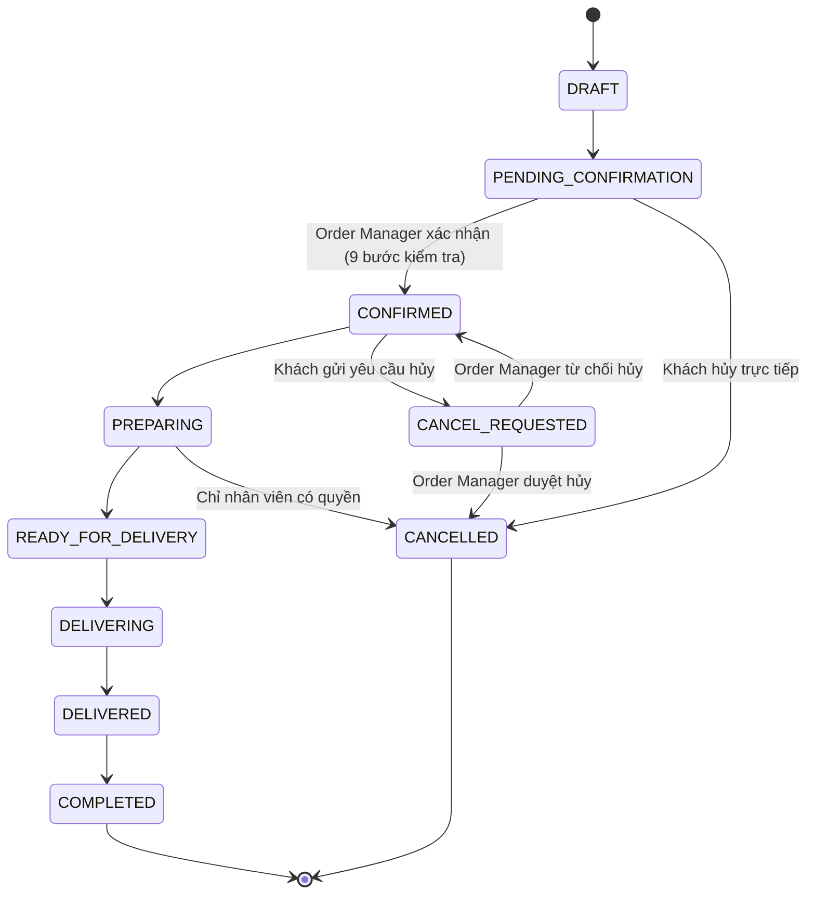
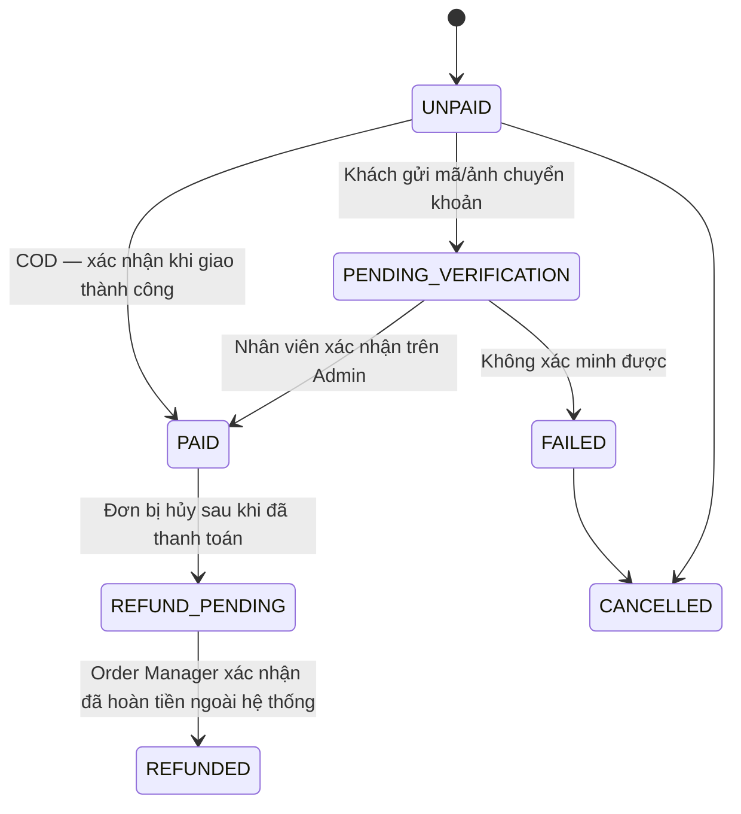
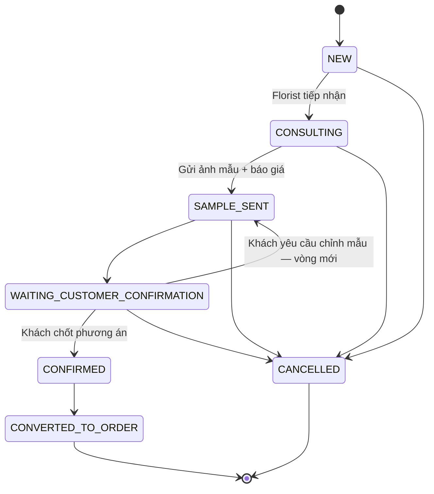

# 3. State machine

## 3.1 Đơn hàng — quyền hủy theo trạng thái

| Trạng thái | Khách hàng | Nhân viên có quyền |
|---|---|---|
| `PENDING_CONFIRMATION` | Hủy trực tiếp | Hủy trực tiếp |
| `CONFIRMED` | Chỉ gửi yêu cầu hủy | Duyệt / từ chối yêu cầu |
| `PREPARING` | Không được hủy | Chỉ Order Manager / Shop Owner |
| `READY_FOR_DELIVERY` | Không được hủy | Không hủy, chỉ xử lý sự cố thủ công |
| `DELIVERING` | Không được hủy | Không hủy |
| `DELIVERED` | Không hủy — chỉ mở khiếu nại | Không hủy |

Mọi cạnh trên sơ đồ tương ứng một bản ghi bắt buộc trong `order_status_histories`; không có cạnh nào khác được phép ở tầng service (trả lỗi `INVALID_STATE_TRANSITION` — xem [06-permission-error.md](06-permission-error.md)).

## 3.2 Trạng thái thanh toán

Ảnh chuyển khoản **không phải bằng chứng thanh toán cuối** — chỉ chuyển `PENDING_VERIFICATION → PAID` khi nhân viên xác nhận thủ công trên Admin Portal. Hoàn tiền bắt buộc ghi chú, người xác nhận và mã tham chiếu.

## 3.3 Yêu cầu hoa thiết kế riêng

