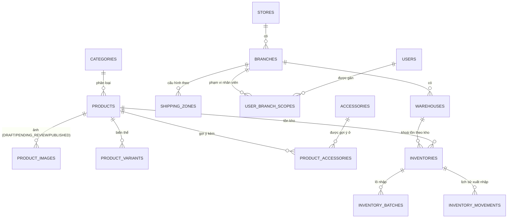
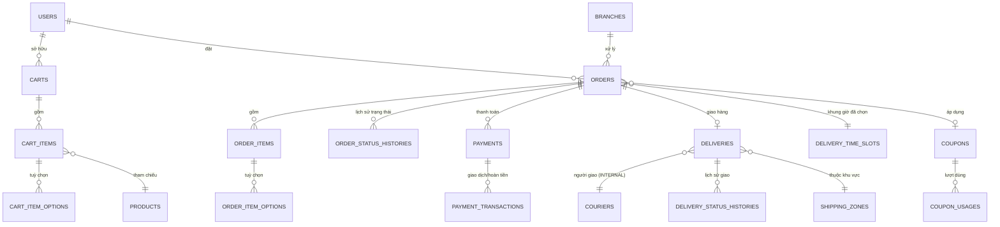
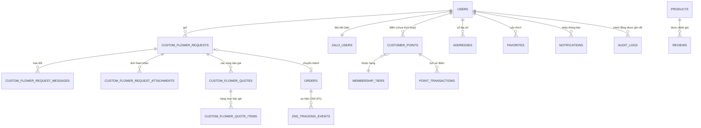

# 4. ERD & Database dictionary

Chia thành 3 sơ đồ theo miền nghiệp vụ để giữ khả năng đọc; quan hệ khoá ngoại giữa 3 sơ đồ được nối qua `products`, `orders` và `users` (lặp lại làm nút neo). Toàn bộ trường tiền tệ dùng `decimal`, không dùng `float`.

## 4.1 Miền A — Cửa hàng, danh mục & tồn kho

## 4.2 Miền B — Giỏ hàng, đơn hàng, thanh toán & giao hàng

## 4.3 Miền C — Hoa theo yêu cầu, thành viên & hỗ trợ

## 4.4 Database dictionary

| Bảng | Mục đích | Trường khoá đáng chú ý |
|---|---|---|
| `stores` / `branches` / `warehouses` | Phân cấp cửa hàng — kho; MVP seed 1-1-1 nhưng schema đa chi nhánh | `store_id`, `branch_id`, `warehouse_id` |
| `user_branch_scopes` | Giới hạn phạm vi thao tác của nhân viên theo chi nhánh | `user_id`, `branch_id`, `role` |
| `categories` / `products` / `product_variants` / `product_images` | Catalogue; ảnh có quy trình duyệt `status` | `status` (DRAFT/PENDING_REVIEW/PUBLISHED) |
| `accessories` / `product_accessories` | Phụ kiện & gợi ý kèm sản phẩm | `product_id`, `accessory_id` |
| `inventories` / `inventory_batches` / `inventory_movements` | Tồn kho theo kho + theo lô; ghi vết mọi xuất/nhập/hao hụt | `warehouse_id`, `reserved_qty`, `available_qty` |
| `carts` / `cart_items` / `cart_item_options` | Giỏ hàng — không giữ chỗ tồn kho ở bước này | `user_id`, `product_id` |
| `orders` / `order_items` / `order_item_options` | Đơn hàng; giá chốt tại thời điểm đặt | `branch_id`, `unit_price`, `price_includes_tax` |
| `order_status_histories` | Ghi vết mọi cạnh chuyển trạng thái đơn (§3.1) | `order_id`, `from_status`, `to_status`, `actor_id` |
| `payments` / `payment_transactions` | Trạng thái thanh toán + lịch sử giao dịch/hoàn tiền | `method` (COD/BANK_TRANSFER/ZALOPAY), `status` |
| `deliveries` / `couriers` / `delivery_status_histories` | Giao hàng nội bộ; trường mở cho provider ngoài ở P1 | `provider_type=INTERNAL`, `external_delivery_id` |
| `shipping_zones` / `delivery_time_slots` | Cấu hình phí theo khu vực × loại giao + khung giờ khả dụng | `zone_code`, `base_fee`, `express_surcharge`, `exact_time_surcharge` |
| `coupons` / `coupon_usages` | Voucher & giới hạn lượt dùng | `code`, `min_order_amount`, `usage_limit` |
| `custom_flower_requests` + 4 bảng con | Luồng tư vấn thiết kế riêng nhiều vòng (§1.4 mục 4) | `status`, `request_id` |
| `membership_tiers` / `customer_points` / `point_transactions` | Dựng sẵn cho P1 — mặc định hạng `MEMBER`, điểm = 0 | `tier`, `points_balance` |
| `reviews` / `favorites` / `addresses` | Đánh giá, yêu thích, sổ địa chỉ khách hàng | `product_id`, `user_id` |
| `zalo_users` / `notifications` / `zns_tracking_events` | Liên kết Zalo, thông báo in-app, tracking ZNS (P1) | `msg_id`, `tracking_id`, `provider_status` |
| `audit_logs` | Ghi vết mọi thao tác quản trị nhạy cảm | `actor_id`, `action`, `target_type` |
