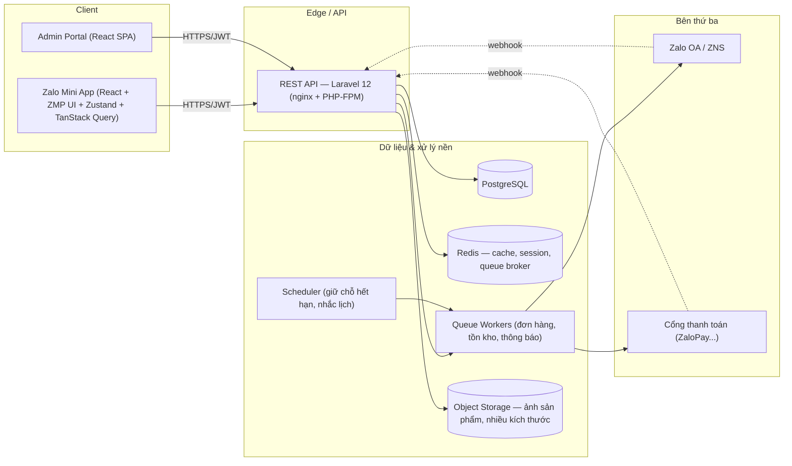

# 7. Kiến trúc hệ thống, cấu trúc thư mục & deployment

## 7.1 Kiến trúc hệ thống



Admin Portal và Mini App dùng chung một REST API, phân quyền theo role thay vì tách backend riêng — giảm trùng lặp logic tính giá/tồn kho/state machine. **Toàn bộ việc tính lại tổng tiền, kiểm tra tồn kho và chuyển trạng thái đơn hàng nằm ở service layer trên API**, không tin bất kỳ số liệu giá nào gửi lên từ client. Webhook từ OA/ZaloPay đi vào cùng một API, xử lý idempotent qua bảng lưu vết sự kiện.

## 7.2 Cấu trúc thư mục — Frontend (Zalo Mini App)

```text
src/
├─ pages/            # 1 thư mục = 1 route đăng ký trong router.tsx
│  ├─ home/  menu/  search/  product-detail/
│  ├─ custom-request/   # đặt hoa theo yêu cầu — mới so với template gốc
│  ├─ checkout/  select-location/  order/  order-detail/  order-success/
│  └─ profile/
├─ components/
│  ├─ common/           # product-card, variant-select, cart-sheet, quantity-stepper...
│  └─ layout/           # header, footer, bottom-nav, cart-float-button
├─ services/<domain>/
│  ├─ <domain>.api.ts    # gọi API thật, không còn .mock.ts ở production
│  ├─ <domain>.queries.ts / .mutations.ts
│  └─ domains: product, category, cart, order, custom-request, coupon, favorite, address, notification
├─ stores/           # zustand: cart.store, checkout.store, ui.store
├─ hooks/            # useZaloAuth, usePhonePermission, useDeliverySlot...
├─ lib/              # axios instance, react-query-provider, api-error, zma helpers
├─ schemas/          # zod schemas dùng chung với React Hook Form
├─ types/  constants/  utils/  tokens.js  css/
├─ app.tsx          # root — render RouterProvider(router)
└─ router.tsx
```

## 7.3 Cấu trúc thư mục — Backend (Laravel 12)

```text
app/
├─ Http/
│  ├─ Controllers/Api/V1/   # mỏng — chỉ validate request & gọi Service
│  ├─ Requests/              # FormRequest theo từng endpoint (422)
│  ├─ Resources/              # API Resource — chuẩn hoá response (§6.3)
│  └─ Middleware/             # JwtAuth, IdempotencyKey, RateLimit
├─ Services/                  # PricingService, InventoryService, OrderStateMachine,
│                              # CouponService, DeliverySlotService
├─ Models/
├─ Jobs/                       # SendZnsNotification, ReleaseExpiredReservation
├─ Events/  Listeners/         # OrderStatusChanged -> notify OA
├─ Policies/                   # phân quyền theo role admin
└─ Notifications/
database/
├─ migrations/  seeders/  factories/
routes/
└─ api.php                     # prefix /api/v1, group theo domain
```

## 7.4 Admin Portal

SPA riêng (React + TypeScript), gọi cùng REST API với JWT + role admin; cấu trúc thư mục tương tự Mini App (`pages/products`, `pages/orders`, `pages/inventory`...) nhưng thêm `pages/reports` và một lớp `guards/` theo permission matrix (§6.1).

## 7.5 Deployment

- **Môi trường:** Local (Docker Compose) → Development → Staging → Production, biến số qua `.env` theo từng môi trường, không chia sẻ secret giữa các môi trường.
- **Container hoá:** `nginx` + `php-fpm` (API), build tĩnh riêng cho Mini App/Admin (không chạy Node ở production), `postgres`, `redis`, queue worker (Laravel Horizon hoặc `queue:work` theo supervisor), scheduler (Laravel Scheduler qua cron).
- **CI/CD:** chạy migration, seeding môi trường non-production, test suite (unit/integration), build frontend, deploy có health-check trước khi chuyển traffic.
- **Vận hành dữ liệu:** backup PostgreSQL định kỳ, log rotation cho API/queue, giám sát lỗi gắn `request_id` để truy vết theo chuẩn response ở §6.3.
- **Rollback:** migration có thể đảo ngược cho thay đổi schema không phá vỡ; không rollback ngược schema đã có dữ liệu production nếu không có kịch bản migrate dữ liệu kèm theo.
